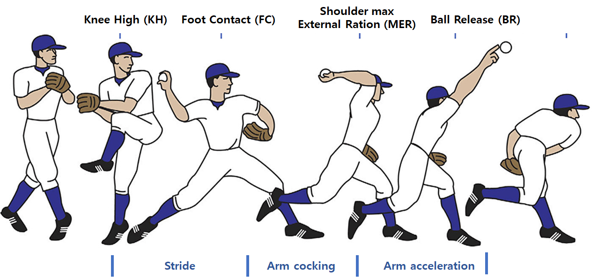

- [투수 리포트 (Pitching Report)](https://github.com/parkdragonstone/kookmin-report-explain?tab=readme-ov-file#투수-리포트-pitching-report)
    - [분석 구간](https://github.com/parkdragonstone/kookmin-report-explain?tab=readme-ov-file#분석-구간)
    - [Pitching Efficiency](https://github.com/parkdragonstone/kookmin-report-explain?tab=readme-ov-file#pitching-efficiency)
    - [Stride Phase](https://github.com/parkdragonstone/kookmin-report-explain?tab=readme-ov-file#stride-phase)
    - [Arm Cocking Phase](https://github.com/parkdragonstone/kookmin-report-explain?tab=readme-ov-file#arm-cocking-phase)
    - [Arm Acceleration Phase](https://github.com/parkdragonstone/kookmin-report-explain?tab=readme-ov-file#arm-acceleration-phase)

 

- [타자 리포트 (Hitting Report)](https://github.com/parkdragonstone/kookmin-report-explain?tab=readme-ov-file#타자-리포트-hitting-report)
    - [Swing Efficiency](https://github.com/parkdragonstone/kookmin-report-explain?tab=readme-ov-file#swing-efficiency)
    - [Loading Phase](https://github.com/parkdragonstone/kookmin-report-explain?tab=readme-ov-file#loading-phase)
    - [Stride Phase](https://github.com/parkdragonstone/kookmin-report-explain?tab=readme-ov-file#stride-phase-1)
    - [Swing Phase](https://github.com/parkdragonstone/kookmin-report-explain?tab=readme-ov-file#swing-phase)

## 투수 리포트 (Pitching Report)

### 분석 구간

- 시점
    1. Knee High (KH) : 무릎을 최대로 들어 올릴 때
    2. Foot Contact (FC) : 스트라이드 다리가 지면과 접촉했을 때
    3. Shoulder Max ER (MER) : 어깨가 최대로 외회전 됐을 때
    4. Ball Release (BR) : 투수가 공을 던지는 시점

- 구간
    1. Stride Phase : KH와 FC 사이의 시간으로 투수가 타자 방향으로 추진하는 단계
    2. Arm Cocking Phase : FC와 MER 사이의 시간으로 투수의 던지는 팔이 외회전 되면서 던지기 전에 에너지를 저장하는 단계
    3. Arm Acceleration : MER과 BR 사이의 시간으로 공을 던지기 위해 팔을 앞으로 회전하고 가속하는 단계
---

### Pitching Efficiency

- Kinematic Sequence
---

### Stride Phase

- Hip/Shoulder Separation
- Elbow Flexion
- Trail Leg GRF (AP axis)
- Trail Leg GRF (Vertical)
---

### Arm Cocking Phase

- Shoulder External Rotation
- Shoulder Horizontal Abduction
- Lead Leg Knee Flexion
- Lead Leg Knee Extention Angular Velocity
- Lead Leg GRF (AP axis)
- Lead Leg GRF (Vertical)
---

### Arm Acceleration Phase

- Shoulder Abduction
- Trunk Forward Tilt
- Trunk Lateral Tilt
- Lead Leg Knee Flexion
- Lead Leg Knee Extention Angular Velocity
- Lead Leg GRF (AP axis)
- Lead Leg GRF (Vertical)

---
---

## 타자 리포트 (Hitting Report)

- 시점
    1. Toe Off (TO) : 앞 발을 지면에서 떨어졌을 때
    2. Knee High (KH) : 앞 다리의 무릎을 최대로 들어올렸을 때
    3. Foot Contact (FC) : 앞 발이 지면과 접촉하였을 때
    4. Ball Contact (BC) : 공을 임팩트 했을 때

- 구간
    1. Loading Phase : TO와 KH 사이의 시간으로 뒷 발에 체중을 싣는 구간.
    2. Stride Phase : KH와 FC 사이의 시간으로 투수 방향으로 추진하는 구간
    3. Swing Phase : FC와 BC 사이의 시간으로 타자가 스윙하는 구간
---

### Swing Efficiency

- Kinematic Sequence
- X-Factor
- Stride Length
---

### Loading Phase

- Sway [Shank Angle]
- Rear Leg Torque
---

### Stride Phase

- Loss Of Posture [Trunk Lateral Tilt]
- Rear Leg AP GRF
---

### Swing Phase

- Dead Hands [Lead Shoulder - Hand Distance]
- Casting The Hands [Elbow Flexion]
- Loss Of Space 1 [Pelvis Open Timing]
- Loss Of Space 2 [Lead Shoulder - Hand  Distance]
- Loss Of Space 3 [Elbow Height]
- Rear Leg Ground Reaction Force [Vertical]
- Rear Leg Torque
- Lead Leg Ground Reaction Force (Vertical)
- Lead Leg Torque
- Rear & Lead Leg Ground Reaction Force (AP axis)
- Rear Shoulder Ad/Abduction Angular Velocity
- Lead Leg Knee Extension Angular Velocity
- Lead Elbow Extension Angular Velocity
- Trunk Lateral Tilt